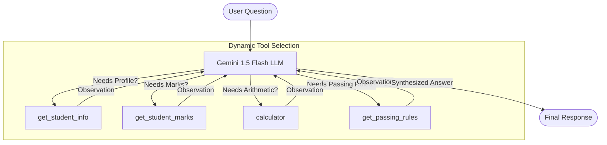

# Day 5: LangChain Agent with Google Gemini & SQLite

[](https://colab.research.google.com/github/Vigneshwarans32241/SODAK/blob/main/day%205/day5_langchain_gemini_agent.ipynb)
[](https://www.python.org/)
[](https://python.langchain.com/)
[](https://ai.google.dev/)

> An autonomous student advisory agent built with **LangChain** and **Google Gemini** that dynamically queries an SQLite database, computes arithmetic metrics, and evaluates academic eligibility against university passing rules.

---

## 🚀 Quick Launch (Google Colab)

Click the badge below to run the complete notebook directly in Google Colab with zero local setup:

[](https://colab.research.google.com/github/Vigneshwarans32241/SODAK/blob/main/day%205/day5_langchain_gemini_agent.ipynb)

---

## 📋 Problem Statement & Overview

You are given an SQLite database (`students.db`) containing student academic marks across 4 subjects (`python`, `database`, `ai`, `web`). The goal is to build an autonomous **LangChain Agent** that dynamically selects from 4 specialized tools to answer queries rather than hardcoding procedural execution.

### Database Schema (`students.db`)

| student_id | name | department | python | database | ai | web |
| :--- | :--- | :--- | :---: | :---: | :---: | :---: |
| **22CS045** | Dhanushya | Computer Science | 85 | 72 | 90 | 78 |
| **22CS046** | Rahul | Computer Science | 65 | 70 | 68 | 72 |
| **22CS047** | Priya | Information Technology | 92 | 88 | 95 | 90 |
| **22CS048** | Arun | Information Technology | 55 | 60 | 58 | 62 |
| **22CS049** | Meena | Computer Science | 78 | 85 | 80 | 88 |

---

## 🛠️ The 4 LangChain Tools

| Tool Signature | Purpose & Docstring |
| :--- | :--- |
| **`get_student_info(student_id)`** | Queries SQLite database for student's full name and department. |
| **`get_student_marks(student_id)`** | Queries SQLite database for marks in Python, Database, AI, and Web. |
| **`calculator(expression)`** | Evaluates mathematical expressions to compute totals, averages, and percentages. |
| **`get_passing_rules()`** | Returns university criteria: Min 40% overall average and Min 35% in each subject. |

---

## 🧠 Dynamic Tool Trajectories



### Evaluation Questions Tested:

1. **Question 1:** *"What is the name and department of student 22CS045?"*
   - Trajectory: `get_student_info`
2. **Question 2:** *"What are the marks of 22CS047?"*
   - Trajectory: `get_student_marks`
3. **Question 3:** *"What is the total and average mark of 22CS045?"*
   - Trajectory: `get_student_marks` $\rightarrow$ `calculator`
4. **Question 4:** *"Is 22CS045 eligible to pass according to the university rules?"*
   - Trajectory: `get_student_marks` $\rightarrow$ `get_passing_rules` $\rightarrow$ `calculator`
5. **Challenge Question:** *"I am 22CS045. Tell me my name, department, total marks, average marks, and whether I satisfy the university passing requirements."*
   - Trajectory: `get_student_info` $\rightarrow$ `get_student_marks` $\rightarrow$ `calculator` $\rightarrow$ `get_passing_rules` $\rightarrow$ Final Answer

---

## 💻 Local Setup & Execution

1. Clone repository:
```bash
git clone https://github.com/Vigneshwarans32241/SODAK.git
cd "SODAK/day 5"
```

2. Install dependencies:
```bash
pip install langchain langchain-google-genai langchain-community
```

3. Configure API Key:
```bash
export GEMINI_API_KEY="your-gemini-api-key"
# On Windows PowerShell:
# $env:GEMINI_API_KEY="your-gemini-api-key"
```

4. Run tests:
```bash
python test_agent.py
```

---

## 📄 Submission Link

- **GitHub Assignment Link:**  
  `https://github.com/Vigneshwarans32241/SODAK/tree/main/day%205`
- **Colab Notebook Direct Link:**  
  `https://colab.research.google.com/github/Vigneshwarans32241/SODAK/blob/main/day%205/day5_langchain_gemini_agent.ipynb`
