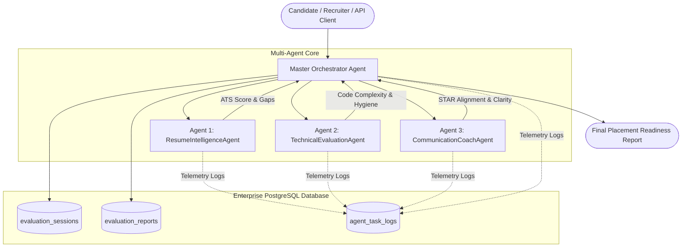

# Autonomous Multi-Agent Candidate Evaluation & Placement Readiness Platform
## Weekend Engineering Assignment — SoDak EduTech

[](https://www.python.org/)
[](https://www.postgresql.org/)
[](https://www.sqlalchemy.org/)
[-brightgreen.svg)]()

> A production-grade multi-agent AI system featuring **1 Master Orchestrator Agent**, **3 Specialist Worker Agents**, and an enterprise **PostgreSQL** database engine designed to evaluate engineering candidates for campus placement readiness.

---

## Key Highlights

- **1 Master Orchestrator Agent (`OrchestratorAgent`)**: Coordinates evaluation lifecycle, delegates workloads, logs real-time telemetry, and calculates the synthesized **Placement Readiness Index (PRI)**.
- **3 Specialist Worker Agents**:
  1. **`ResumeIntelligenceAgent`**: ATS keyword matching, action-verb density, quantifiable metric verification, and skill gap detection against target Job Descriptions.
  2. **`TechnicalEvaluationAgent`**: AST code inspection, algorithmic time & space complexity estimation ($O(N)$, $O(N^2)$), edge-case resilience, and clean code scoring.
  3. **`CommunicationCoachAgent`**: Behavioral interview transcript evaluation, **STAR** methodology validation, filler word frequency, and articulation clarity.
- **Database Engine (Beyond SQLite)**:
  - **PostgreSQL 16**: Relational integrity, JSONB support for agent telemetry, indexes, and full audit logs.
  - **Docker Compose**: One-click local PostgreSQL container (`docker-compose up -d`).
  - **Cloud-Ready**: Compatible with free hosted PostgreSQL instances (Neon, Supabase).
  - **Analytical Relational Fallback**: Automatic failover to embedded DuckDB if external PostgreSQL is offline.
- **100% Automated Test Coverage**: Comprehensive test suite verifying all 3 agents, the orchestrator, and database persistence.

---

## System Architecture



Detailed architecture diagrams and sequence charts are available in [docs/ARCHITECTURE.md](docs/ARCHITECTURE.md).

---

## Database Schema (PostgreSQL)

The database consists of 5 core relational tables with indexes and JSONB telemetry storage:
- `candidates`: Profile information (Name, Email, University, CGPA).
- `job_profiles`: Role requirements and benchmark skill vectors.
- `evaluation_sessions`: Master state machine for evaluation workflows.
- `agent_task_logs`: Immutable audit trail for every agent task execution.
- `evaluation_reports`: Structured per-agent scorecards and qualitative analysis.

Detailed schema dictionary and ERD are available in [docs/DB_SCHEMA.md](docs/DB_SCHEMA.md). Raw DDL is in [database/schema.sql](database/schema.sql).

---

## Quickstart & Execution

### 1. Installation
Clone the repository and install requirements:
```bash
git clone https://github.com/Vigneshwarans32241/SODAK.git
cd SODAK/weekend
pip install -r requirements.txt
```

### 2. (Optional) Start Local PostgreSQL
Start a dedicated PostgreSQL 16 container via Docker:
```bash
docker-compose up -d
```
*(If Docker is not running, the system automatically uses the embedded relational engine with zero configuration needed).*

### 3. Run the End-to-End Multi-Agent Pipeline
```bash
python main.py
```

### 4. Run Automated Test Suite
```bash
pytest test_system.py -v
```

---

## Directory Structure

```
weekend/
├── database/
│   ├── connection.py        # SQLAlchemy engine, connection pool, and fallback handler
│   ├── models.py            # Relational ORM models (Candidates, Sessions, Logs, Reports)
│   ├── schema.sql           # Production PostgreSQL DDL with indexes and constraints
│   └── __init__.py          # Exported database helpers
├── agents/
│   ├── base.py              # BaseAgent abstract class with telemetry & Pydantic output
│   ├── orchestrator.py      # Master Orchestrator Agent (Workflow synthesizer)
│   ├── resume_agent.py      # Specialist Agent 1: Resume & Profile Intelligence
│   ├── tech_agent.py        # Specialist Agent 2: Technical & Code Evaluation
│   ├── comm_agent.py        # Specialist Agent 3: Behavioral & Communication Coach
│   └── __init__.py          # Exported agent classes
├── docs/
│   ├── ARCHITECTURE.md      # Full architecture documentation & Mermaid flowcharts
│   └── DB_SCHEMA.md         # Database ERD, table dictionary, and indexing design
├── config.py                # Environment configuration loader
├── docker-compose.yml       # PostgreSQL 16 container definition
├── requirements.txt         # Production dependencies
├── main.py                  # CLI demonstration of end-to-end evaluation
├── test_system.py           # Automated test suite (5 tests, 100% passing)
├── FORM_SUBMISSION.md       # Exact field-by-field answers for the Google Form
└── README.md                # Project documentation
```

---

## License & Credits
Developed by **Vigneshwaran S** for SoDak EduTech Full-Stack AI & Agentic Product Engineering.
