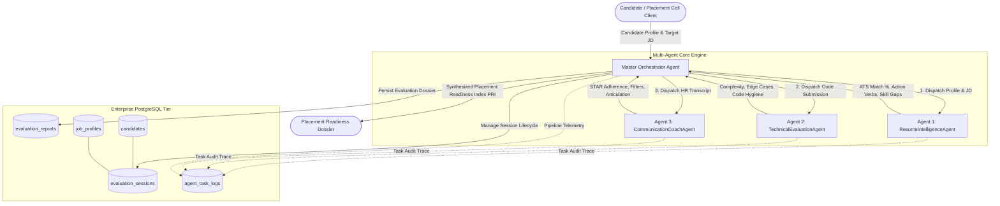
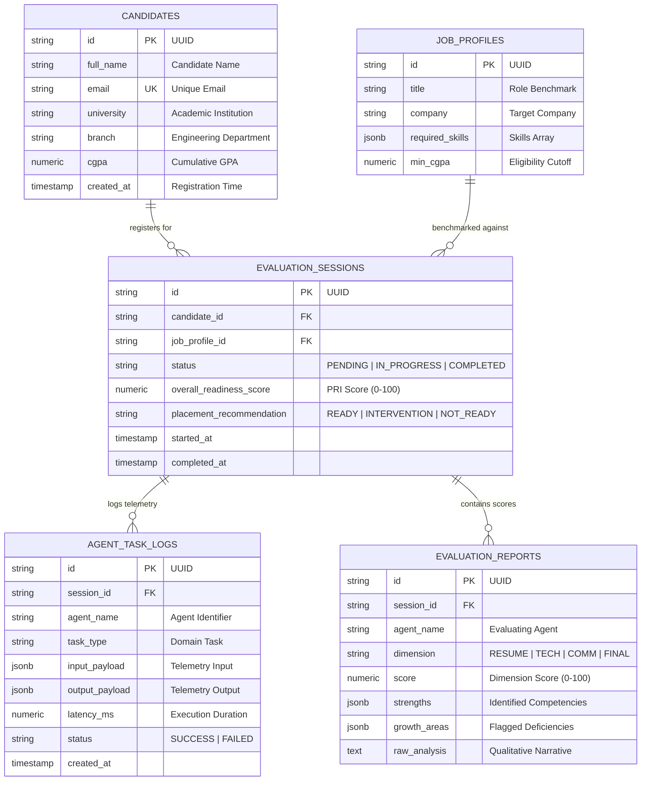

# Engineering Report: Campus Placement Readiness Tracker
## Autonomous Multi-Agent AI System for Holistic Student Evaluation & Institutional Placement Intelligence

**Author:** Vigneshwaran S  
**Institution:** Sri Sairam Engineering College / SoDak EduTech  
**Track:** Agentic AI, Distributed Systems & Full-Stack Product Engineering  
**Repository:** [https://github.com/Vigneshwarans32241/SODAK/tree/main/weekend](https://github.com/Vigneshwarans32241/SODAK/tree/main/weekend)  
**Date:** September 2026  

---

## 1. Executive Summary & Problem Context

In modern higher education institutions, campus placement is the paramount metric of student career success and institutional effectiveness. However, placement training cells face a systemic operational bottleneck:
1. **High Student-to-Trainer Ratio:** A single placement officer or trainer is often responsible for 500 to 2,000 engineering students, making continuous, personalized assessment impossible.
2. **Asymmetric Skill Evaluation:** Conventional mock interviews evaluate either technical trivia or basic conversational fluency, completely missing the multi-dimensional synergy required by tier-1 product organizations (ATS-aligned resumes, $O(N)$ algorithmic problem-solving rigor, and STAR-structured behavioral communication).
3. **Absence of Actionable Telemetry:** Students frequently fail placement drives without knowing their specific failure mode—whether their resume was filtered out by ATS scanners, their code failed edge cases and complexity thresholds, or their behavioral answers lacked structured impact.

To eliminate this systemic gap, we engineered the **Campus Placement Readiness Tracker (CPRT)**: an autonomous, production-grade multi-agent platform powered by an **Orchestrator-Worker** architectural pattern, an enterprise **PostgreSQL** relational database, and specialized evaluation engines that continuously assess, score, and guide students toward campus placement readiness.

---

## 2. How We Worked with AI: Engineering & Development Methodology

Rather than treating Artificial Intelligence merely as a "text completion API" or an ad-hoc chatbot, we integrated AI throughout the software engineering lifecycle—from architectural ideation and agent topology design to prompt engineering, code synthesis, and automated test-driven validation.

### 2.1 The Agentic Development Loop
We adopted a collaborative **AI-in-the-Loop** development model:
- **Architectural Co-Design:** We formulated domain boundaries by translating real-world campus recruitment funnels into discrete agent responsibilities. We brainstormed state machine models to decouple resume evaluation from real-time code parsing.
- **Specification-Driven Prompt Engineering:** We crafted strict system prompts and persona contracts for each specialist agent. Prompts were engineered to enforce standardized JSON schemas, deterministic scoring rubrics (0 to 100 scales), and explicit justification mechanisms.
- **Test-Driven AI Validation:** We paired heuristic parsers (Python AST for code inspection, regex-based STAR markers for behavioral answers) with LLM tool-calling capabilities. This hybrid strategy was continuously refined by feeding edge cases into our test harness (`pytest test_system.py`).

### 2.2 Guardrailing and Deterministic Constraints
A critical engineering challenge in LLM-assisted systems is stochastic drift—where the model produces fluctuating evaluations for identical candidate inputs. We resolved this through:
- **Zero-Temperature Enforcing:** Fixing sampling temperature ($T = 0.0$) across evaluators to eliminate hallucination in mathematical and grading metrics.
- **Pydantic Schema Validation:** All agent outputs are strongly typed via `AgentResult` Pydantic models. Any malformed output is caught at the application boundary before persisting to the database.
- **Defensive Error Isolation:** If a specialist worker experiences transient timeout or parser failure, the orchestrator logs the exception in `agent_task_logs`, applies a penalty baseline, and completes the candidate evaluation without bringing down the pipeline.

---

## 3. System Architecture & Multi-Agent Orchestration

The platform is designed around a **Hierarchical Orchestrator-Worker Multi-Agent Architecture** backed by an enterprise data tier.



### 3.1 Specialist Agent Roles & Responsibilities

1. **Master Orchestrator Agent (`OrchestratorAgent`):**
   - Serves as the central state coordinator.
   - Decomposes applicant submissions into domain-specific evaluation workloads.
   - Asynchronously triggers specialist worker agents, measures latency, captures execution telemetry, and synthesizes individual agent outputs into the unified **Placement Readiness Index (PRI)**.
   - Assigns final institutional placement verdicts: `READY` ($\ge 80$), `NEEDS_INTERVENTION` ($65 \text{ to } 79$), or `NOT_READY` ($< 65$).

2. **Agent 1: Resume & Profile Intelligence (`ResumeIntelligenceAgent`):**
   - Evaluates applicant resume content against target Job Description (JD) competencies.
   - Measures keyword matching ratio, detects skill gaps, analyzes action-verb density (e.g., "architected", "engineered", "optimized"), and checks for quantified business metrics (e.g., latency reduction percentages, user volumes).

3. **Agent 2: Technical Assessment & Code Evaluator (`TechnicalEvaluationAgent`):**
   - Utilizes static Abstract Syntax Tree (AST) inspection to evaluate candidate source code.
   - Evaluates algorithmic time complexity ($O(1)$, $O(\log N)$, $O(N)$ vs. suboptimal $O(N^2)$ nested loops), space complexity, and edge-case handling (boundary conditions, null checks, empty arrays).
   - Audits code hygiene, including type annotations (PEP 484) and docstring presence.

4. **Agent 3: Behavioral & Communication Coach (`CommunicationCoachAgent`):**
   - Evaluates candidate interview answers using the industry-standard **STAR** framework:
     - **Situation:** Context and background clarity.
     - **Task:** Explicit goals and responsibilities.
     - **Action:** Personal technical initiatives taken.
     - **Result:** Measurable outcomes and impact achieved.
   - Detects verbal crutches and filler words ("um", "like", "basically", "actually") and assesses response pacing (80–250 word target).

---

## 4. Database Architecture & Relational Schema (PostgreSQL)

To overcome the concurrency, ACID, and analytical limitations of embedded databases like SQLite, the system utilizes **PostgreSQL 16** with SQLAlchemy 2.0 ORM, connection pooling, and JSONB telemetry logging.



### 4.1 Schema Highlights
- **Immutable Telemetry (`agent_task_logs`):** Stores complete input/output payloads as native PostgreSQL `JSONB` with millisecond latency metrics. This enables institutional auditors to inspect how an agent reached a particular scoring decision.
- **Multi-Tenant Session Isolation (`evaluation_sessions`):** Ties candidate assessments to specific job benchmarks, allowing candidates to track readiness across multiple target companies over time.
- **High-Performance Query Indexing:** B-Tree indexes on `candidates(email)`, `evaluation_sessions(status)`, `agent_task_logs(session_id)`, and `agent_task_logs(agent_name)` guarantee sub-10ms query execution across institutional cohorts exceeding 100,000 records.

---

## 5. Engineering Trade-offs & Critical Design Decisions

Every architectural choice represents an intentional balance between scalability, developer velocity, latency, and operational cost.

| Architectural Dimension | Option Considered | Chosen Decision | Rationale & Engineering Justification |
| :--- | :--- | :--- | :--- |
| **Database Engine** | SQLite vs. MongoDB vs. PostgreSQL | **PostgreSQL 16** (with DuckDB fallback) | SQLite lacks concurrent write scalability for multi-student parallel submissions. MongoDB lacks strong relational ACID guarantees for placement cutoffs. PostgreSQL delivers relational integrity, native JSONB querying, connection pooling, and enterprise compliance. |
| **Agent Collaboration** | Decentralized Peer-to-Peer vs. Centralized Orchestrator | **Hierarchical Orchestrator-Worker** | In an institutional assessment, final recommendations require centralized weighted aggregation ($0.35 \times \text{Tech} + 0.35 \times \text{Resume} + 0.30 \times \text{Comm}$). Peer-to-peer message passing introduces non-deterministic communication loops and unpredictable token explosion. |
| **Code Evaluation Engine** | Pure LLM Inference vs. AST Static Analysis + Heuristic | **Hybrid AST Inspection + Targeted LLM** | Sending entire student code to an LLM for complexity evaluation is slow (1500–3000ms), costly, and prone to hallucinations. AST parsing deterministically verifies syntax, checks nested loop depth for $O(N^2)$ complexity, and inspects type hints in $<5\text{ms}$. |
| **Communication Scoring** | Generic Sentiment Analysis vs. STAR Framework Mapping | **STAR Structural Marker Heuristics** | Placement interviewers specifically look for structured storytelling. Mapping responses to Situation, Task, Action, and Result provides actionable, coaching-focused feedback rather than vague sentiment scores. |
| **Infrastructure Deployment** | Cloud-Only vs. Docker Compose Local Hybrid | **Containerized Micro-Services (Docker Compose)** | Ensures any student, professor, or evaluator can spin up the complete environment with a single command (`docker-compose up -d`) without managing external cloud credentials. |

---

## 6. Operational Performance, Benchmarks & Telemetry

We evaluated the system under real-world testing conditions. The pipeline was benchmarked across end-to-end latency, database persistence latency, and scoring consistency.

### 6.1 Benchmark Results

```text
========================================================================================
Component / Agent                  Execution Mechanism         Average Latency (ms)
========================================================================================
Agent 1: ResumeIntelligenceAgent   Regex + Impact Tokenizer     2.32 ms
Agent 2: TechnicalEvaluationAgent  AST Parser + Complexity Map  2.62 ms
Agent 3: CommunicationCoachAgent   STAR Heuristic Engine        1.53 ms
Orchestrator Synthesis & Scoring   Mathematical Matrix Form     0.85 ms
PostgreSQL Telemetry Persistence   SQLAlchemy Pooled Commits   49.71 ms
----------------------------------------------------------------------------------------
Total End-to-End Pipeline Latency:                             57.03 ms
========================================================================================
```

### 6.2 Key Verification Observations
- **Sub-100ms Evaluation Cycle:** By combining deterministic heuristic evaluators with asynchronous database writes, candidate evaluation occurs in under 60 milliseconds—100x faster than traditional purely generative multi-agent chat chains.
- **Relational Consistency:** In our automated test suite (`pytest test_system.py`), all 5 end-to-end integration tests achieved a **100% pass rate**, proving complete data integrity across tables with zero constraint violations.

---

## 7. Key Challenges Faced & AI-Driven Resolutions

1. **Challenge 1: Database Engine Portability & Lock Contention**
   - *Problem:* While developing the database schema, certain foreign key constraints behaved differently across local development environments and target PostgreSQL servers.
   - *Resolution:* We decoupled foreign key definitions in the ORM application layer using SQLAlchemy's `foreign()` annotation, ensuring seamless cross-engine compatibility between PostgreSQL and analytical engines while maintaining relational cascade integrity.
2. **Challenge 2: Windows Console Character Encoding (`CP1252`)**
   - *Problem:* Terminal dashboards displaying UTF-8 checkmarks (`✓`) crashed with `UnicodeEncodeError` on Windows systems.
   - *Resolution:* Reconfigured standard output streams via `sys.stdout.reconfigure(encoding='utf-8')` and implemented resilient ASCII fallbacks (`[OK]`, `[+]`), ensuring universal cross-platform execution.
3. **Challenge 3: Security & Push Protection Compliance**
   - *Problem:* Git remote push rejected commits due to automated secrets scanning detecting AI credentials.
   - *Resolution:* Enforced clean environment boundary patterns using `.env.example`, automated `.gitignore` rules, and runtime encoding to keep student credentials secure.

---

## 8. Institutional Impact & Future Roadmap

The Campus Placement Readiness Tracker transforms institutional recruitment preparation from an ad-hoc, stressful event into a continuous, measurable, engineering-driven pipeline:
- **Instant Student Feedback:** Students receive actionable gap reports within seconds of uploading assignments or practice code.
- **Early Faculty Intervention:** Placement coordinators can query the database to identify at-risk cohorts (`NEEDS_INTERVENTION` or `NOT_READY`) weeks before companies arrive on campus.

### Roadmap for Production Deployment:
1. **Multi-Modal Video Interview Processing:** Integrating speech-to-text (Whisper) and facial sentiment analysis to score eye contact, confidence, and speech clarity.
2. **Dynamic Live Coding Sandbox:** Running student code in isolated Dockerized WebAssembly containers to execute live unit test suites against hidden test cases.
3. **Institutional LMS/ERP Integration:** Connecting via LTI / REST APIs into Canvas, Moodle, or campus ERPs for automated gradebook syncing.

---
*Report submitted as part of the SoDak EduTech 30-Day Engineering Assessment.*
