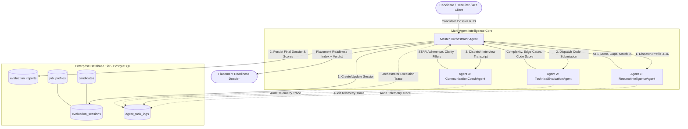
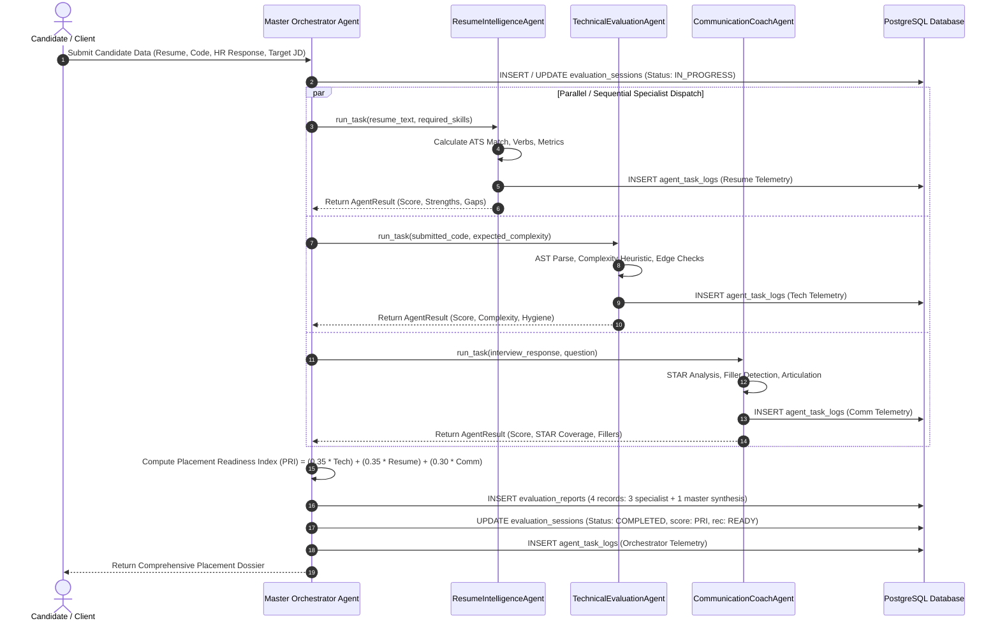

# System Architecture Specification
## Autonomous Multi-Agent Placement Readiness Platform

**Author:** Vigneshwaran S  
**Email:** vigneshwarans3224@gmail.com  
**Course:** SoDak EduTech — Agentic AI & Full-Stack Engineering  
**Repository:** [https://github.com/Vigneshwarans32241/SODAK/tree/main/weekend](https://github.com/Vigneshwarans32241/SODAK/tree/main/weekend)  

---

## 1. High-Level Architecture Overview

The system implements a **Hierarchical Orchestrator-Worker Multi-Agent Architecture** coupled with a production **PostgreSQL** persistence and telemetry layer.

---

## 2. Multi-Agent System Roles & Responsibilities

| Agent Identifier | Pattern / Role | Core Responsibilities & Evaluation Criteria | Output Dimension |
| :--- | :--- | :--- | :--- |
| **`OrchestratorAgent`** | Master Controller / Workflow Synthesizer | Manages lifecycle, distributes evaluation workloads, aggregates telemetry, calculates weighted **Placement Readiness Index (PRI)**, and determines placement recommendation (`READY`, `NEEDS_INTERVENTION`, `NOT_READY`). | `FINAL_SYNTHESIS` |
| **`ResumeIntelligenceAgent`** | Specialist Worker 1 | Evaluates ATS keyword alignment against target Job Description, measures action-verb density, verifies quantified business impact metrics, and flags skill gaps. | `RESUME_ATS` |
| **`TechnicalEvaluationAgent`** | Specialist Worker 2 | Inspects code submissions via AST parsing, estimates time & space complexity ($O(N)$, $O(N^2)$), audits edge-case handling (nulls, empty bounds), and scores clean code practices. | `TECHNICAL_RIGOR` |
| **`CommunicationCoachAgent`** | Specialist Worker 3 | Evaluates behavioral/HR responses against the **STAR** framework (Situation, Task, Action, Result), penalizes conversational fillers, and evaluates response pacing and articulation. | `BEHAVIORAL_COMM` |

---

## 3. End-to-End Execution Sequence Diagram

---

## 4. Scoring Algorithm & Decision Matrix

The **Placement Readiness Index (PRI)** is formulated as:

$$\text{PRI} = 0.35 \times S_{\text{Tech}} + 0.35 \times S_{\text{Resume}} + 0.30 \times S_{\text{Comm}}$$

### Placement Decision Matrix:
- **$\text{PRI} \ge 80.0$**: **`READY`**  
  Direct institutional recommendation for tier-1 product and technical placements.
- **$65.0 \le \text{PRI} < 80.0$**: **`NEEDS_INTERVENTION`**  
  Solid fundamentals with specific deficiencies flagged by specialist agents (e.g., missing required framework skills or sub-optimal algorithmic complexity). Targeted mentorship module assigned.
- **$\text{PRI} < 65.0$**: **`NOT_READY`**  
  Fundamental training required across core algorithmic problem-solving or communication structuring.

---

## 5. Fault Tolerance & Reliability
- **Connection Health Checks:** The system includes real-time connection pinging (`SELECT 1;`) with connection pooling (`pool_size=10, max_overflow=20, pool_pre_ping=True`).
- **Telemetry Isolation:** If an agent encounters a runtime failure during task execution, the error is isolated, logged into `agent_task_logs`, and default penalty fallbacks are applied without crashing the entire orchestration pipeline.
- **Multi-Engine Portability:** Standard PostgreSQL dialect with graceful local analytical fallback engine.
