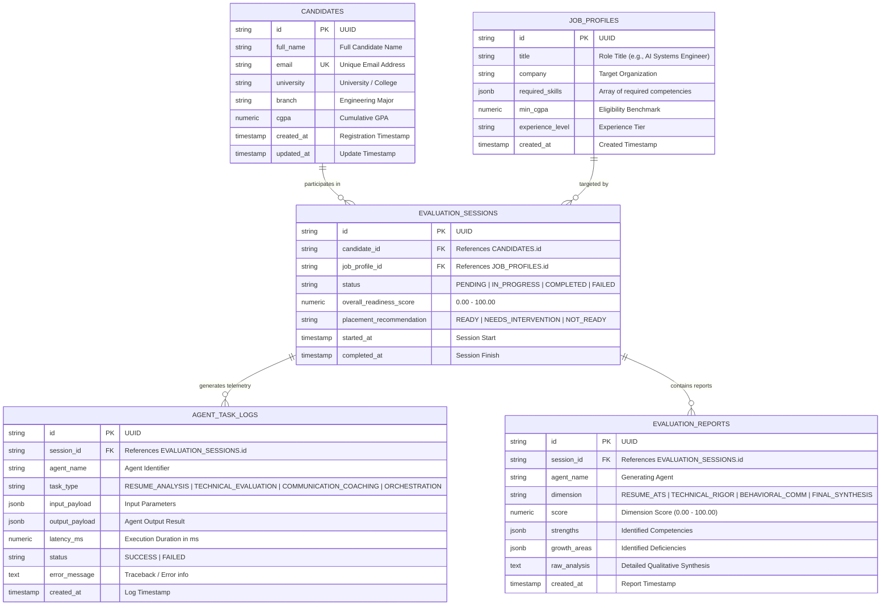

# PostgreSQL Database Architecture & Schema Specification
## Autonomous Multi-Agent Placement Readiness Platform

**Author:** Vigneshwaran S  
**Email:** vigneshwarans3224@gmail.com  
**Database Engine:** PostgreSQL 16 (Relational & Analytical JSONB)  
**Schema File:** [`database/schema.sql`](https://github.com/Vigneshwarans32241/SODAK/blob/main/weekend/database/schema.sql)  

---

## 1. Entity Relationship Diagram (ERD)



---

## 2. Table Data Dictionary

### Table: `candidates`
Stores student / candidate profile metadata undergoing placement assessments.

| Column | PostgreSQL Data Type | Constraints | Description |
| :--- | :--- | :--- | :--- |
| `id` | `VARCHAR(36)` | `PRIMARY KEY` | Unique UUIDv4 identifier. |
| `full_name` | `VARCHAR(150)` | `NOT NULL` | Full legal name of candidate. |
| `email` | `VARCHAR(255)` | `NOT NULL, UNIQUE` | Unique student institutional/personal email. |
| `university` | `VARCHAR(255)` | `NULLABLE` | Academic institution. |
| `branch` | `VARCHAR(100)` | `NULLABLE` | Engineering branch / department. |
| `cgpa` | `NUMERIC(4, 2)` | `NULLABLE` | Cumulative Grade Point Average (0.00 - 10.00). |
| `created_at` | `TIMESTAMPTZ` | `DEFAULT CURRENT_TIMESTAMP` | Profile creation timestamp. |
| `updated_at` | `TIMESTAMPTZ` | `DEFAULT CURRENT_TIMESTAMP` | Last updated timestamp. |

---

### Table: `job_profiles`
Benchmark criteria and required skill vectors for target engineering roles.

| Column | PostgreSQL Data Type | Constraints | Description |
| :--- | :--- | :--- | :--- |
| `id` | `VARCHAR(36)` | `PRIMARY KEY` | Unique UUIDv4 identifier. |
| `title` | `VARCHAR(150)` | `NOT NULL` | Role designation. |
| `company` | `VARCHAR(150)` | `NOT NULL` | Company / Hiring entity. |
| `required_skills` | `JSONB` | `NOT NULL` | JSON array of required skill keywords. |
| `min_cgpa` | `NUMERIC(4, 2)` | `DEFAULT 7.00` | Minimum eligibility CGPA threshold. |
| `experience_level`| `VARCHAR(50)` | `DEFAULT 'Fresh Graduate'` | Target seniority tier. |
| `created_at` | `TIMESTAMPTZ` | `DEFAULT CURRENT_TIMESTAMP` | Benchmark registration date. |

---

### Table: `evaluation_sessions`
Core state machine record managed by the **Master Orchestrator Agent**.

| Column | PostgreSQL Data Type | Constraints | Description |
| :--- | :--- | :--- | :--- |
| `id` | `VARCHAR(36)` | `PRIMARY KEY` | Unique UUIDv4 identifier. |
| `candidate_id` | `VARCHAR(36)` | `NOT NULL, FK -> candidates(id)` | Candidate being evaluated. |
| `job_profile_id`| `VARCHAR(36)` | `FK -> job_profiles(id)` | Benchmark role applied for. |
| `status` | `VARCHAR(50)` | `NOT NULL, DEFAULT 'PENDING'` | State: `PENDING`, `IN_PROGRESS`, `COMPLETED`, `FAILED`. |
| `overall_readiness_score` | `NUMERIC(5, 2)` | `NULLABLE` | Final synthesized PRI score (0.00 - 100.00). |
| `placement_recommendation`| `VARCHAR(50)` | `NULLABLE` | Final verdict: `READY`, `NEEDS_INTERVENTION`, `NOT_READY`. |
| `started_at` | `TIMESTAMPTZ` | `DEFAULT CURRENT_TIMESTAMP` | Pipeline start timestamp. |
| `completed_at` | `TIMESTAMPTZ` | `NULLABLE` | Pipeline completion timestamp. |

---

### Table: `agent_task_logs`
Immutable audit and execution telemetry trace for all 3 specialist agents + orchestrator.

| Column | PostgreSQL Data Type | Constraints | Description |
| :--- | :--- | :--- | :--- |
| `id` | `VARCHAR(36)` | `PRIMARY KEY` | Unique UUIDv4 identifier. |
| `session_id` | `VARCHAR(36)` | `NOT NULL, FK -> evaluation_sessions(id)` | Associated session. |
| `agent_name` | `VARCHAR(100)` | `NOT NULL` | Name of agent executing the task. |
| `task_type` | `VARCHAR(100)` | `NOT NULL` | Task identifier (`RESUME_ANALYSIS`, etc.). |
| `input_payload`| `JSONB` | `NULLABLE` | Arguments and context passed to agent. |
| `output_payload`| `JSONB`| `NULLABLE` | Structured evaluation output from agent. |
| `latency_ms` | `NUMERIC(10, 2)` | `NULLABLE` | Duration of agent execution in milliseconds. |
| `status` | `VARCHAR(30)` | `NOT NULL, DEFAULT 'SUCCESS'` | `SUCCESS`, `RETRY`, `FAILED`. |
| `error_message`| `TEXT` | `NULLABLE` | Stack trace or failure description. |
| `created_at` | `TIMESTAMPTZ` | `DEFAULT CURRENT_TIMESTAMP` | Log emission timestamp. |

---

### Table: `evaluation_reports`
Per-agent score breakdowns, strengths, growth areas, and qualitative recommendations.

| Column | PostgreSQL Data Type | Constraints | Description |
| :--- | :--- | :--- | :--- |
| `id` | `VARCHAR(36)` | `PRIMARY KEY` | Unique UUIDv4 identifier. |
| `session_id` | `VARCHAR(36)` | `NOT NULL, FK -> evaluation_sessions(id)` | Associated session. |
| `agent_name` | `VARCHAR(100)` | `NOT NULL` | Evaluating agent. |
| `dimension` | `VARCHAR(100)` | `NOT NULL` | Dimension evaluated (`RESUME_ATS`, `TECHNICAL_RIGOR`, etc.). |
| `score` | `NUMERIC(5, 2)` | `NOT NULL` | Dimension score (0.00 - 100.00). |
| `strengths` | `JSONB` | `NULLABLE` | JSON array of identified strengths. |
| `growth_areas` | `JSONB` | `NULLABLE` | JSON array of targeted improvement areas. |
| `raw_analysis` | `TEXT` | `NULLABLE` | Detailed narrative analysis and feedback. |
| `created_at` | `TIMESTAMPTZ` | `DEFAULT CURRENT_TIMESTAMP` | Generation timestamp. |

---

## 3. High-Performance Indexing Strategy

```sql
-- Fast candidate profile lookups
CREATE INDEX idx_candidates_email ON candidates(email);

-- Session query optimization by candidate and workflow status
CREATE INDEX idx_sessions_candidate ON evaluation_sessions(candidate_id);
CREATE INDEX idx_sessions_status ON evaluation_sessions(status);

-- High-speed multi-agent telemetry and audit retrieval
CREATE INDEX idx_task_logs_session ON agent_task_logs(session_id);
CREATE INDEX idx_task_logs_agent ON agent_task_logs(agent_name);

-- Sub-millisecond report rendering
CREATE INDEX idx_reports_session ON evaluation_reports(session_id);
```
